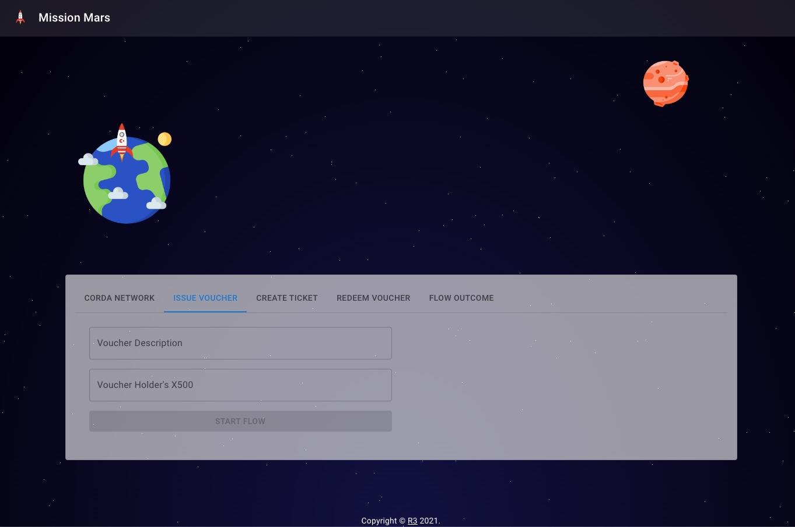

## Tutorial Cordapp Sample

This folder features the tutorial CorDapps that are featured in the Corda 5 development tutorial documentations. 

### [Mission Mars](./missionmars):
A simple Corda 5 CorDapp that depicts a space travel story. The spaceship company and issue and redeem space travel vouchers with the buyers. 

  

### [Solar System Probs](./solarsystem):
The solar system app allows planet nodes to documents the cosmo probes between one another. All of the Probs are documented on the imutable ledger. 

